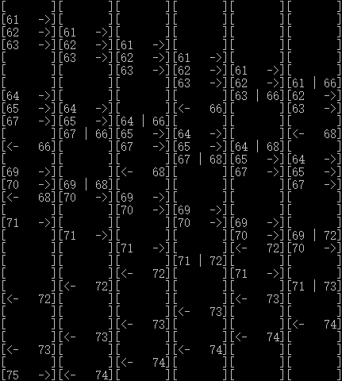

# Solution for Part C
This part implements the problem C. Compared to part A, the difference is that the rule 3 is cancelled, which means, all processes can be treated as one type. The processor now do not need to check the process type anymore. However, programs of each type that is allowed to be launched in an atom time should still be limited to 1, according to the description. So I cancelled the `type` semaphore and set different `time` semaphore for each program type. `M`, `N` and `K` are treated as three different semaphores on process amount. So in this part the logic looks like this:

```Pseudo-C
waitProcess();
waitTime();
waitProcessOfType();

...

signalProcess();
signalTime();
signalPeocessOfType();
```

To specify the parameters `M`, `N` and `K`, change the initial value of variables of corresponding name in `ProcessEmulation.cpp`.

The result looks like this:



It can be judged from the direction that Process (61-65) are of the same type (here it is `M`) while Process (66) belongs to the other (`N`). In this situation, `M=3`, `N=4` and `K=6`. Process (64, 65) has to wait for any of the executing Process (61-63) to finish while Process (66) can be run immediately before Process (64), as at this time remaining M is 0, remaining N is 4 and remaining K is 3.
