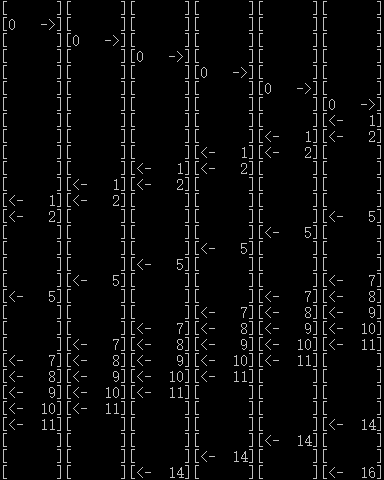

# Solution for Part A
This part implements the problem A. From the description we can extract these information:

1. There is one method of executing the programs, and only once in a time.
2. Every executing program can run simultaneously, and the concurrency of running processes are limited.
3. There are two types of processes, and processes of different kinds cannot be executed at the same time.

Info 1 means there is a constraint that only one program can be executed at a minimal time unit. This can be considered as a critical resource, and I name it `time`.

Additionally, info 2 indicates that all process require a same critical resource, and I name it `process` here. A program that does'n turn into a process cannot be executed.

Info 3 implies that the category of processes allowed to execute is also a critical resource, and I call it `type`.

Therefore, I designed three *semaphores* in this problem, namingly `time`, `process` and `type`. The amount of `time` and type is set to 1 according to the situation as illustrated above, and the amount of `process` is determined by the situation. In this problem, it is 5. The mapping of variables in the description and my program can be listed as follows:

|in Problem Description|&nbsp;&nbsp;&nbsp;&nbsp;|in My Program|
|:--------:|:-:|:--------:|
|pig||process|
|rope||processor|
|function `pig`||the whole program|
|enum `Destination`||enum `ProcessType`|
|`WaitUntilSafeToCross()`||all `acquire...` functions related to semaphore|
|`CrossRavine()`||`NextJiffle()`|
|`DoneWithCrossing()`||all `release...` functions related to semaphore|

The `acquire...` and `release...` functions mentioned here are my implementations of `wait()` and `signal()`. I do not use multithreading to *emulate* the process; rather, I *simulate* with virtual time ticks.

My definition of a semaphore is a C struct:

```C
typedef struct ResourceSemaphoreEntity {
	char description[20];
	int maximumCount, currentCount;
	int minAllocCount;		// minimum amount of resource allocated in one action
	int *exrtaParams, paramCount;
} *ResourceSemaphore;
```

Where `maximumCount`, `currentCount` and `minAllocCount` are necessary properties of a semaphore. Semaphore manipulations are written as sepatared functions prefixed with `acquire`, `release` and so on.

The program automatically generates jobs with `random` function and any desired seed to simulate all possible situations. The output will show the current "running pigs" like this:


